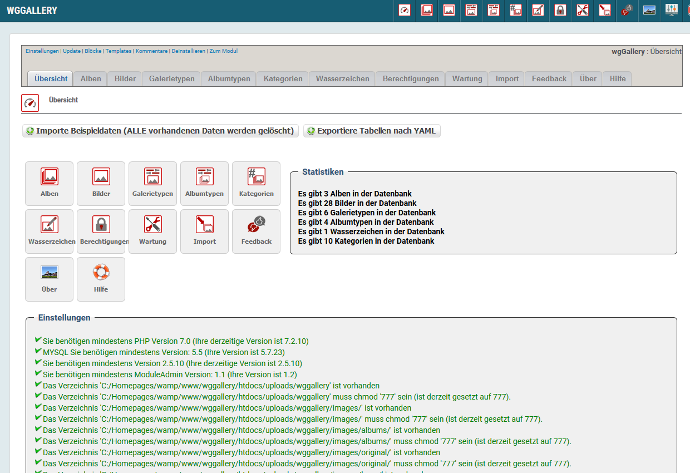

# wgGallery Tutorial

#### Version: 1.14 RC1

#### for XOOPS 2.5.10+

#### for PHP 7.0 +

## User Manual

© 2019 The XOOPS Project \(www.xoops.org\)

## Module Purpose

This module is for presentation of your images in a gallery.

You can defined various albums and combine different albums to a collection. 

This module supports:
* automatic resizing of images to predefined width/height
* multi upload with drag&drop
* enhanced album and image management (sorting by drag&drop)
* the module contains now a completely new image editor
  * automatic resizing of images to predefined width/height
  * easy creation of grid images
  * easy cropping of images
* various album styles, and all album styles have a lot of possible settings to customize your index page and blocks
  * default
  * simple
  * hover effects
  * bootstrap cards
* various gallery types, and all gallery types have a lot of possible settings to customize your gallery
  * Lightbox2
  * Justified Gallery with Colorbox
  * ViewerJs
  * Jssor
  * LC Lightbox LITE
* watermarks can be used
  * text watermark
  * image watermark
* possibility to combine albums to a category
* permission settings for each album/category
  * permission to view
  * permission to download large or mmedium images
* based on bootstrap (for proper showing a bootstrap theme is obligatory)
* maintenance tools
* feedback tool
* import tool for
  * eXtGallery
  * TDMPicture
* storage of EXIF data possible

All used templates on user side are fully responsive.

**This module works only in combination with a bootstrap theme or you have to include bootstrap files manually to your theme.**

## License:

  
Unless specified, this content is licensed under a [Creative Commons Attribution-NonCommercial-ShareAlike 4.0 International License](http://creativecommons.org/licenses/by-nc-sa/4.0/).

All derivative works are to be attributed to XOOPS Project \(www.xoops.org\)

## Tutorial Version: 1.0

