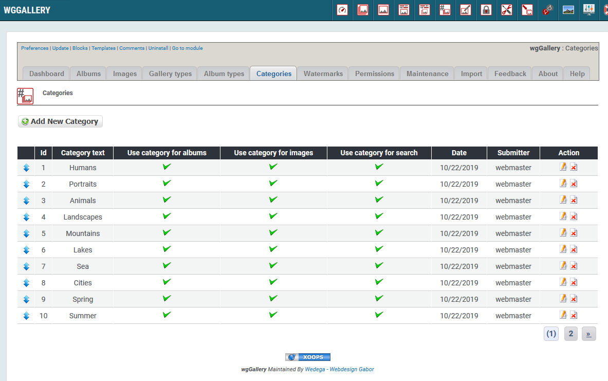
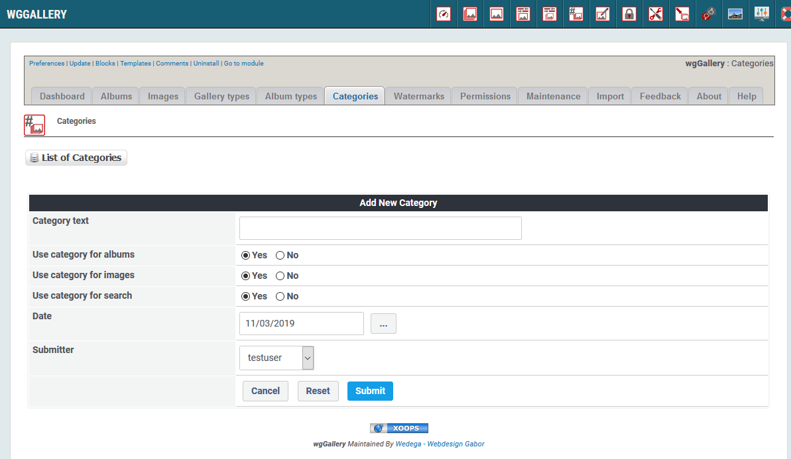

# Kategorien

You can define various categories, which you can used to classify for images or your albums.

The categories can also be used for targeted search \(see [Search]()\).

## 1. List of categories

On the dashboard tab 'Categories' you see a list of the existing categories with the settings.

## 2. Add new/edit category

### 2.1. Category text

This text will be shown on user side.

### 2.2. Usage of category

You can decide for what the category will be used:

* Use category for albums
* Use category for images
* Use category for search

