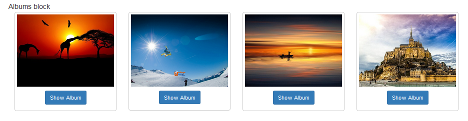
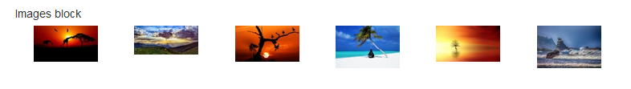

# Blöcke

wgGallery bietet verschiedene Blöcke an:

* Block Alben: Zeigt eine defnierte Anzahl an Alben in einem Block an. Es gibt die Möglichkeit z.B. zufällige oder die neuesten Alben anzeigen zu lassen. Abhängig von den Einstellungen in "Albumtypen" ändert sich auch die Ansicht der Blöcke. 

* Block Bilder: Zeigt eine defnierte Anzahl an Bildern in einem Block an. Es gibt die Möglichkeit z.B. zufällige oder die neuesten Bilder anzeigen zu lassen.

