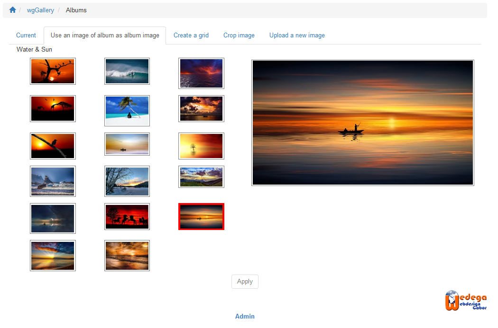
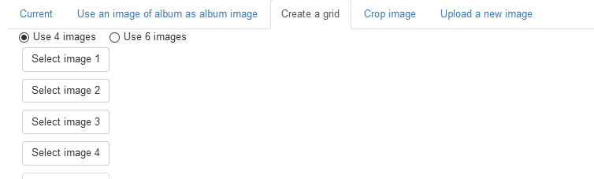
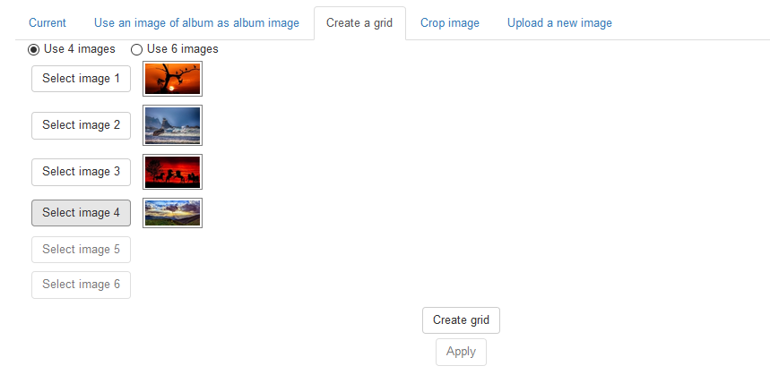
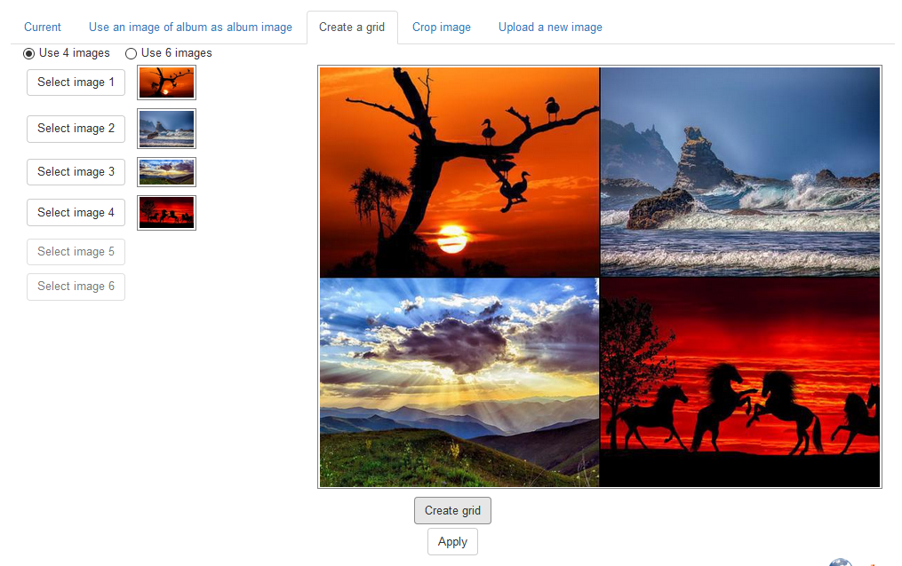
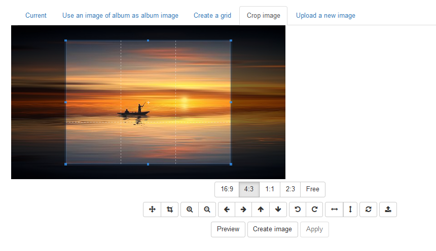

# Album image

wgGallery includes a comprehensive tool for selection/creation of an album image. You have from different pages \(e.g. [Album management](https://app.gitbook.com/@xoops/s/wggallery-tutorial/~/edit/drafts/-LsqgJpRxdCUzilIRGXY/english/the-user-side/album-management)\) the possibility to "Edit album image".

All as album image created images will have the dimension defined in preferences [Options for image processing](https://app.gitbook.com/@xoops/s/wggallery-tutorial/~/edit/drafts/-Lsqk8-Spsq-MZPZqK7e/english/preferences/options-for-image-processing).

### Tabs of editor for album image

#### 1. Current

Tab current shows you current album image, if there is already one define.

#### 2. Use an image of album as album image

You can use on of the images, which are within your album. If you are editing a collection you will have all images of all subalbums available.  
On left side you get a preview of all images. Click on one in order to show it in bigger preview on right side.

For final selection please click on "Apply".

#### 3. Create a grid

Optionally you can also create a grid of 4 or 6 images, based on images of your album.  
First step: decide whether you want to make a grid of 4 or 6 images

Second step: select the images

The images will be used on following position:

* 4 images: 
  * 1 = top left
  * 2 = top right
  * 3 = bottom left
  * 4 = bottom right
* 6 images: 
  * 1 = top left
  * 2 = top center
  * 3 = top right
  * 4 = bottom left
  * 5 = bottom cente
  * 6 = bottom right

After click on "Create grid" the image will be created and a preview appears on right side

For final selection please click on "Apply".

#### 4. Crop image

Once you have selected an image for your album you can additonal crop or edit it.

You can crop, zoom in or out, rotate and so on. If you think the selected range is fine then "Create image".  
For final selection please click on "Apply".

#### 5. Upload new image

Last possibility is to upload a new image or use one of the images in directory /uploads/wggallery/images/albums/.

