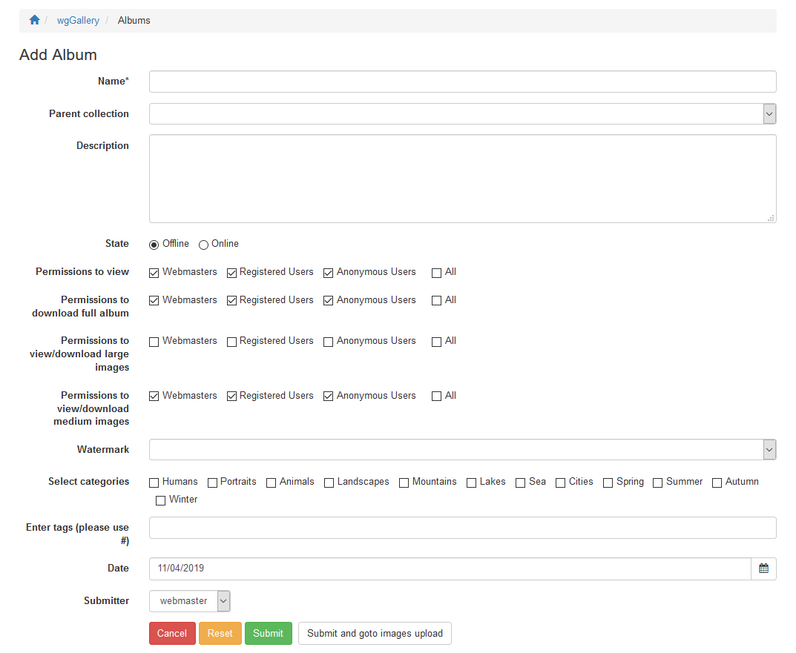

# Create new album

## 1. Steps for creation of album/collection

* Open form
* Enter data
* Submit only or submit and goto image upload \(see [Uploading images](https://app.gitbook.com/@xoops/s/wggallery-tutorial/~/edit/drafts/-Lspqw60el_nyD4U0eKE/english/the-user-side/uploading-images)\)

## 2. Fields

### Name

Enter a name for your album

### Parent collection

If you want to add the album to a specific collection then select this. Otherwise let it blank.

### Description

If you want to can put more details or information about your album in here.

### State

Define the state. As long as it is not "Online" the album is not visible for regular users. If you have not the permission to submit an album without approval then album will automatically get status "Waiting for approval".

### Permissions to view

Define the groups with permission to see this album/collection.

### Permissions to download full album

Define the groups with permission to download full album this album. This is not valid for collections.

### Permissions to view/download large images

Define the groups with permission to view/download large images of this album. This is not valid for collections.

### Permissions to view/download medium images

Define the groups with permission to view/download medium images of this album. This is not valid for collections.

### Watermark

If the watermarks have to be selected for each album seperately then you can select one of existing watermarks. For more information see also [Watermarks](../administration-menu/watermarks.md)

### Select categories

If you are using categories then you can select one or more categories which classify your album. For more information see also [Categories](../administration-menu/categories.md)

### Enter tags

Additionally to categories you can use tags to put additional information to your album.

