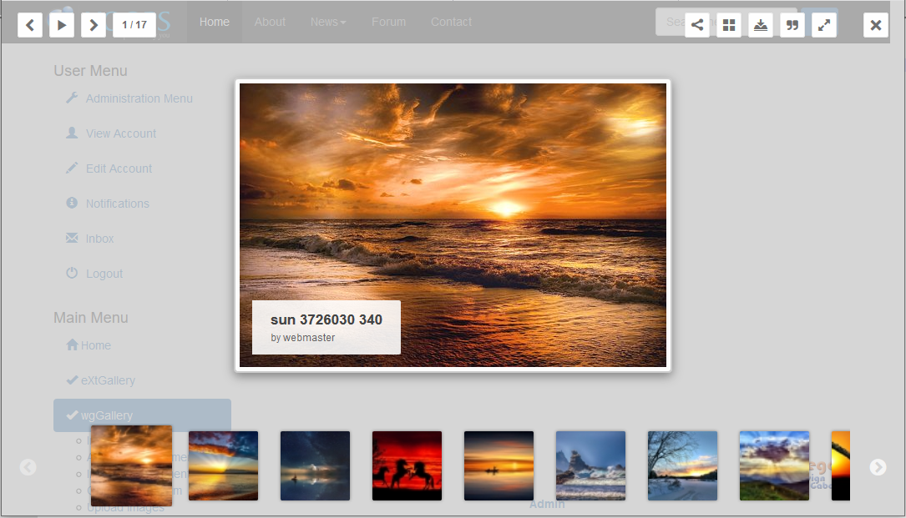

# English

### test

### Version: 1.14 RC1

### for XOOPS 2.5.10+

### for PHP 7.0 +

## User Manual

© 2019 The XOOPS Project \(www.xoops.org\)

## Module Purpose

This module is for presentation of your images in a gallery.

You can defined various albums and combine different albums to a collection. This module supports:

All used templates on user side are fully responsive.

**This module works only in combination with a bootstrap theme or you have to include bootstrap files manually to your theme.**

## License:

  
Unless specified, this content is licensed under a [Creative Commons Attribution-NonCommercial-ShareAlike 4.0 International License](http://creativecommons.org/licenses/by-nc-sa/4.0/).

All derivative works are to be attributed to XOOPS Project \(www.xoops.org\)

## Tutorial Version: 1.0

