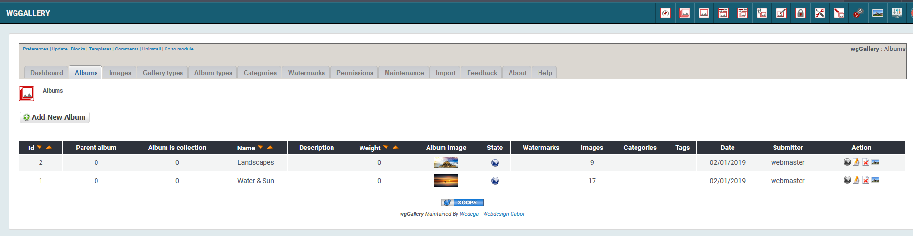
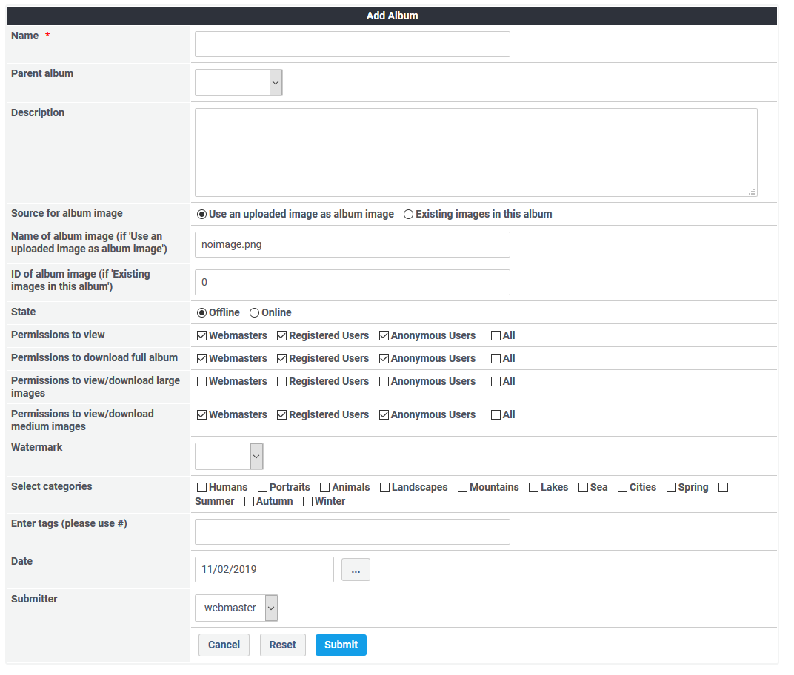

# Albums

You can define various albums, which you can combine with one or more others in a collection.

## 2.2.1 List albums

On the dashboard tab 'albums' you see a list of the existing albums with the settings. 

## 2.2.2 Add new album

## Album name

You can define an album name. This name will be shown on user side.

## Album description

You can provide additional information concerning an album, which will be shown on user side.

## Album image

You can use one image per album as album image. This image will be shown on user side. You can

* use an image from the album or from subalbums of the collection
* create an image grid of images of the album
* crop an image of the album
* upload a new image

For more information concerning album image see 

## State

You can set an album online or offline. Only if an album is online then users will see it on user side. If a submitter doesn't have the permission to set an album online then the album will get the state "Waiting for approval". Such an album must be set online by an authorized user.

## Permissions

You can set following permissions for each group seperately:

* Permissions to view
* Permissions to download full album
* Permissions to view/download large images
* Permissions to view/download medium images

For more information concerning permissions see [Permissions](permissions.md)

## Watermarks

You can define which watermark will be added to the uploaded images of this album.

For more information concerning watermarks see [Watermarks](watermarks.md)

## Categories

You can define vaious categories, which you can link with images or albums and can classify your images. These categories can also used for targeted search.

For more information concerning categories see [Categories](categories.md)

## Tags

Each image or album can have various tags, which can also classify your images. These categories can also used for targeted search.

