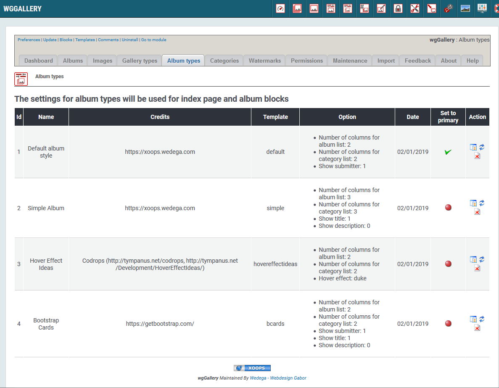

# Album Types

You can define various different album types. Depending on your selection and your settings the albums will be shown in different ways of displaying.

The album type will be used for displaying

* on index page
* in blocks

### 1. List of album types

On the dashboard tab 'Album types' you see a list of the existing album types with the settings. 

Following album types are implemented currently:
* Default album style
* Simple Album
* Hover Effect Ideas
* Bootstrap Cards

For each album type you have different possibities to customize it according your wishes. You can e.g. decide:
* Number of columns per row
* Showing image infos \(like name, title,...\)
* and many more

For implementation of new album types exhausting knowlegde is required, therefore there is no add button.

