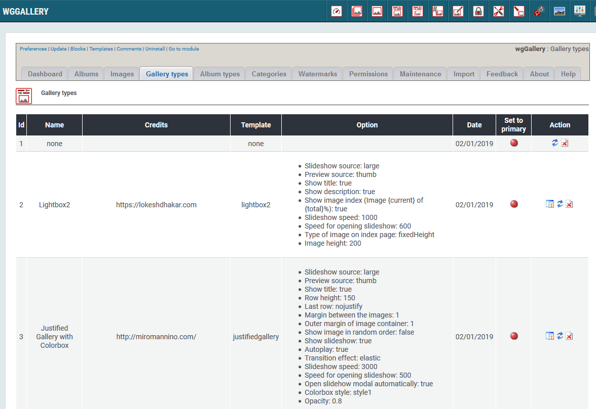

# Gallery Types

You can define various different gallery types. Depending on your selection and your settings the images will be shown in one of the slideshows \(gallery types\).

### 1. List of gallery types

On the dashboard tab 'Gallery Types' you see a list of the existing gallery types with the settings.

Following gallery types are implemented currently:

* Lightbox2
* Justified Gallery with Colorbox
* ViewerJs
* Jssor
* LC Lightbox LITE

For each gallery type you have different possibities to customize it according your wishes. You can e.g. decide:

* Source of images
* showing image infos \(like name, title,...\)
* Autoplay
* Slideshow speed
* and many more

For implementation of new galleries exhausting knowlegde is required, therefore there is no add button.

