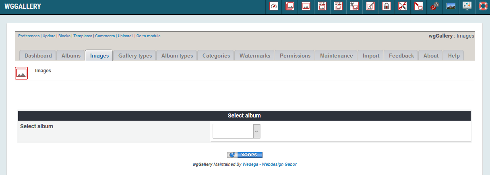
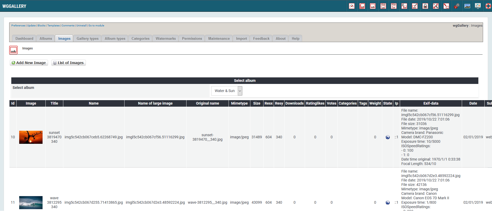

# Images

Each image must be uploaded to a specific album. It is not possible toupload an image and link it later to different albums.

For more details concerning image upload see [Uploading images](../the-user-side/uploading-images.md).

### 1. List of images

On the dashboard tab 'Images' you see a list of the images. In order to show the list you have to select an album first. 

After you have selected an album all images of this album will be listed.

### 2. Add new image

If you want to add an image the wgGallery will switch to [Uploading images](../the-user-side/uploading-images.md) on user side.

