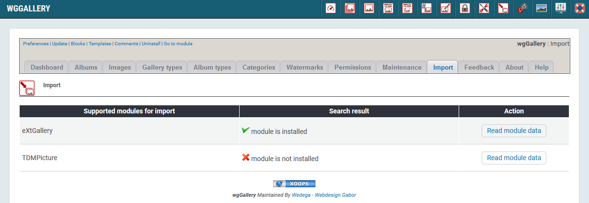
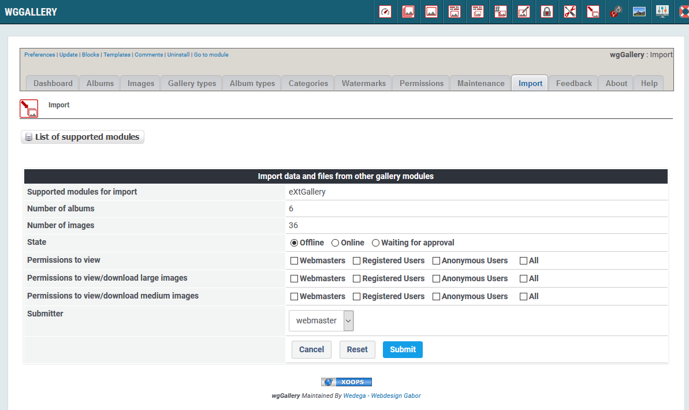

# Import

On the dashboard tab 'Import' wgGallery provides import tools for following XOOPS modules:

* extGallery
* TDMPicture

If you need an import procedure for another module please then contact module developer.

After clicking on "Read module data" you will get an overview of found data and you will have possibilities to set permissions for imported albums.

