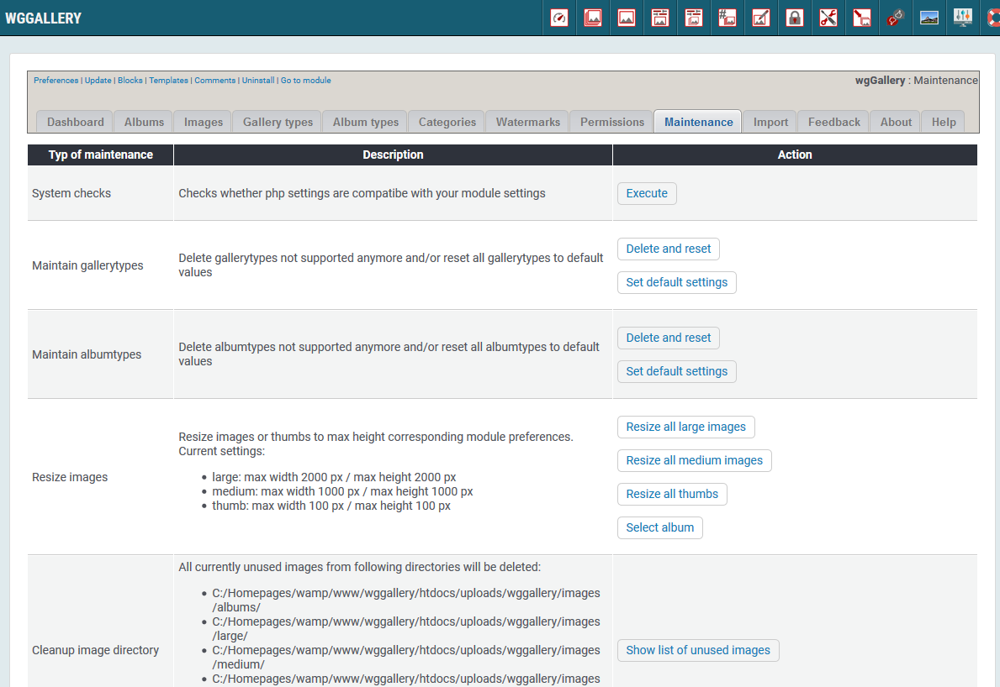

# Maintenance

On the dashboard tab 'Maintenance' wgGallery provides a comprehensive maintenance tool.

With this tool you can keep your module clean and executable. It provides:

* System checks
* Maintain gallerytypes
* Maintain albumtypes
* Resize images
* Cleanup image directory
* Broken items image to directory
* Broken items image to albums
* Add watermarks to an album later
* Read Exif-data
* Check mimetypes
* Check used space in upload directory
* Cleaning ratings/likes
* Cleaning used categories

