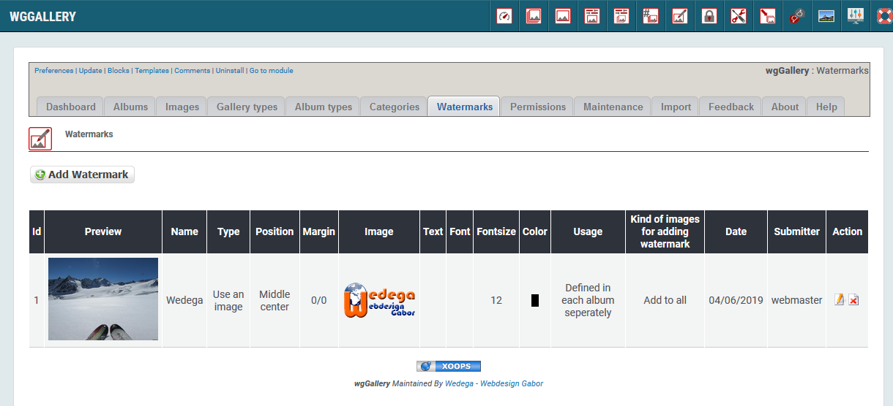
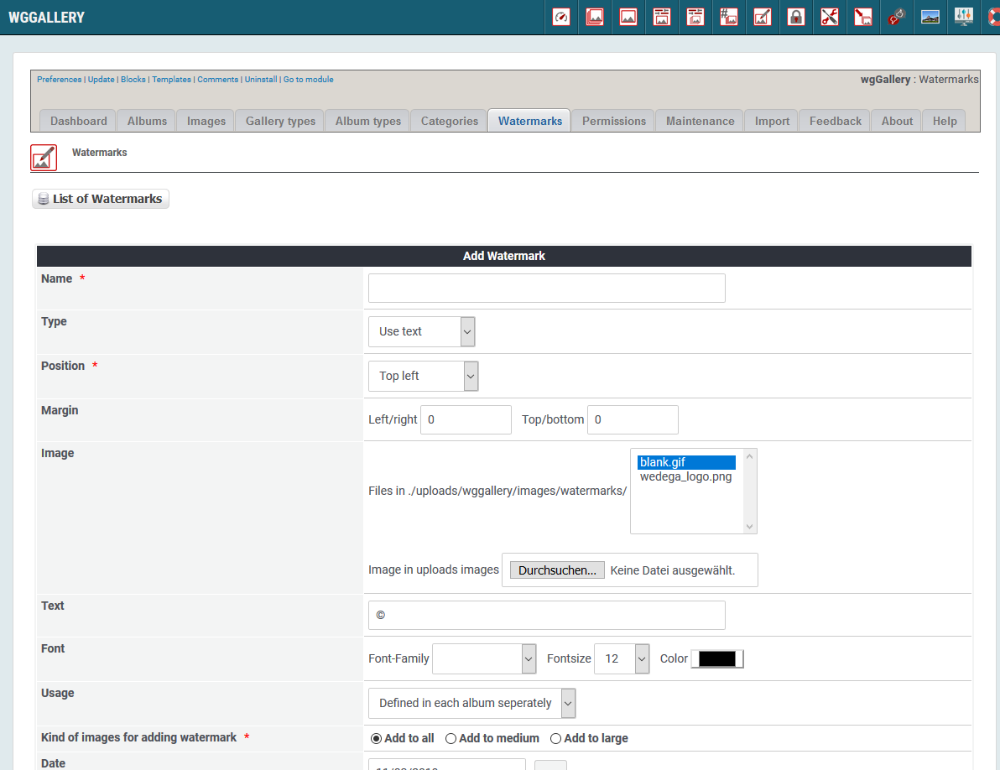

# Watermarks

You can define various watermarks, which you can added to oploaded images.  
You can also decide to which kind of image it will be added. The watermark will be added during upload process.  
Once a watermark is added it can not be removed again.

If you store the original images also then you can later recreate large/medium/thumb images with new or without a watermark.

You can link each album with another watermark.

### 1. List of watermarks

On the dashboard tab 'Categories' you see a list of the existing categories with the settings.  

### 2. Add new/edit watermark

#### 2.1. Name

Define a name for the watermark.

#### 2.2. Type

You can define whether you want to use an image or whether you want to add a text.

#### 2.3. Margin

You can define the margins \(left/right, top/bottom\) of your watermark.

#### 2.4. Image

You can upload your own image for usage as watermark. It is recommended to use png, if you what to have a transparent logo.

#### 2.5. Text

Define the text for watermark, if you have set "Type" to "use text".

#### 2.6. Font

Define the font for watermark, if you have set "Type" to "use text".

#### 2.7. Usage

You can define when the watermark should be used:

* use this watermark in each album
* define in each album, which watermark should be used

#### 2.8. Kind of images

You can define where the watermark should be used:

* for large images
* for medium images
* for both

