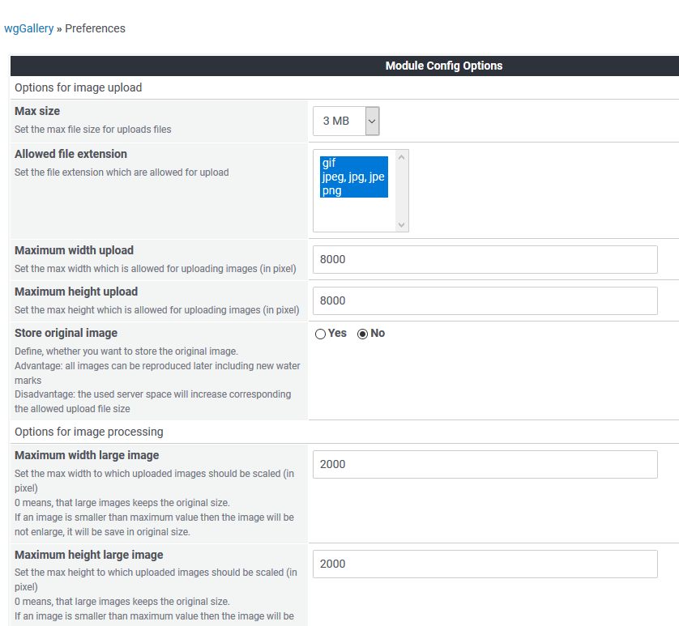

# Preferences

In the module preferences you can set various options for this module:

### Options in detail

* [Options for image upload](options-for-image-upload.md)
* [Options for image processing](options-for-image-processing.md)
* [Options for display](options-for-display.md)
* [Misc options](misc.md)

