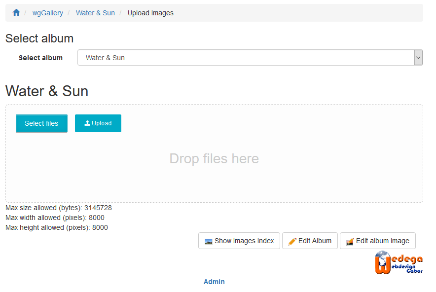
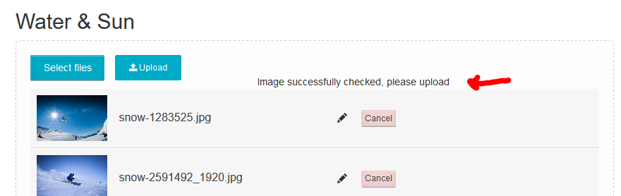
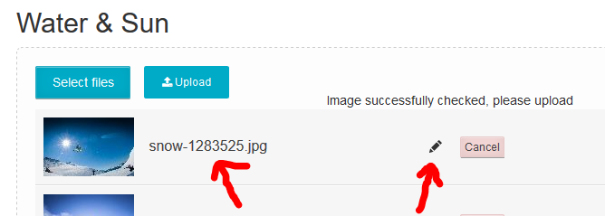
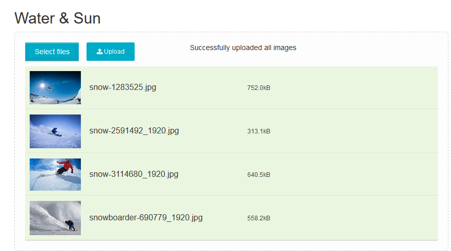

# Uploading images

wgGallery supports multifile upload. The upload tool handle the upload itself, but also various other jobs.

### Steps for upload

* Select album After selecting the album the upload area appears

* Select your files by using your explorer \(click on "Select files"\) or with drag&drop into the drop zone.   Important: there is no file limit from wgGallery, how many files you want to upload at once, but you are limited maybe by the system settings \(php settings\). You can check your settings under maintenance [System check](../administration-menu/maintenance/system-check.md)
* After adding the files wgGallery checks the images whether they are fullfilling the conditions:

  * Is the allowed maximum size exceeded?
  * Is the allowed image dimension \(width or height\) exceeded?

   You can change settings for allowed size/image dimension in [Options for image upload](../preferences/options-for-image-upload.md)

* If all files fullfill the conditions this will be confirmed   
* wgGallery takes the file name as default for image title. if you want to change you can click on the suggested title or on the pen and change as you want   
* Start upload
* Processes during upload
  * Storing original image \(if selected in preferences [Options for image upload](../preferences/options-for-image-upload.md)\)
  * Resizing image corresponding settings in preferences [Options for image upload](../preferences/options-for-image-upload.md)
  * Adding watermark, if a watermark is linked with current album \(see [Albums](../administration-menu/albums.md) and [Watermarks](../administration-menu/watermarks.md)\)
  * saving different types \(large, medium, thumb\) of images in upload directory
  * reading information of image
    * size
    * dimension
    * mime type
    * EXIF \(only if option in preferences [Options for image processing](../preferences/options-for-image-processing.md)
* After successful upload each line gets a green backgound and the upload tools confirm success   

## Next steps

After uploading the images you can goto

* [Image index](image-index.md) in order to check all images
* [Image management](image-management.md) in order to check/change sorting of images
* [Album image](https://app.gitbook.com/@xoops/s/wggallery-tutorial/~/edit/drafts/-Lsp6ZJlrSkVXk5zy3up/english/the-user-side/album-image) in order to select an image as album image

  
 

