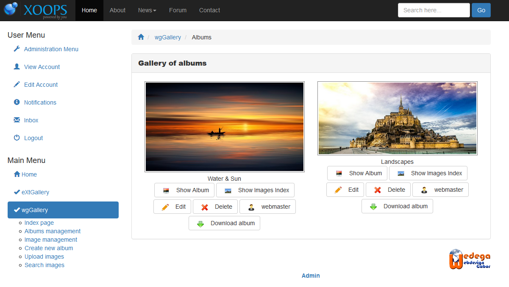

# Benutzerseite

On user side you get an overview from all albums and collection, which are online currently.

Depending on the permissions of current user the user have additionally following possibilities:

* album management \(see also [album managements](https://github.com/XoopsDocs/wggallery-tutorial/tree/970974041b371931e9142e26945f03af9877c0f0/english/album_management.md)\)
* create albums \(see also [create albums](https://github.com/XoopsDocs/wggallery-tutorial/tree/970974041b371931e9142e26945f03af9877c0f0/english/album_create.md)\)
* upload images \(see also [upload images](https://github.com/XoopsDocs/wggallery-tutorial/tree/970974041b371931e9142e26945f03af9877c0f0/english/upload_images.md)\)
* search albumms or images \(see also [search](https://github.com/XoopsDocs/wggallery-tutorial/tree/970974041b371931e9142e26945f03af9877c0f0/english/search.md)\)

