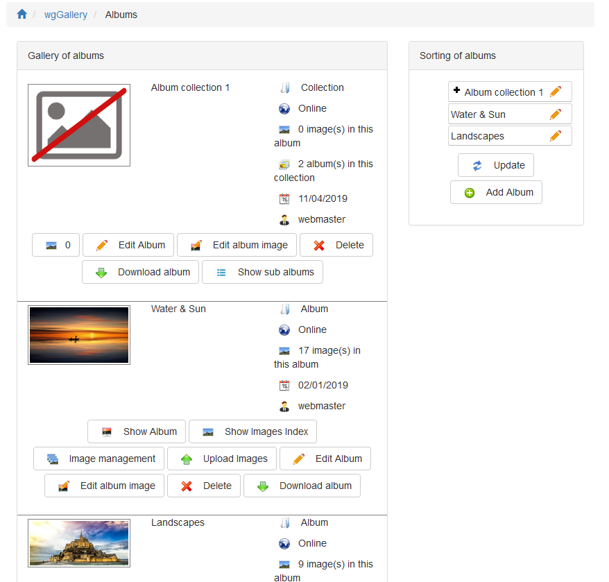
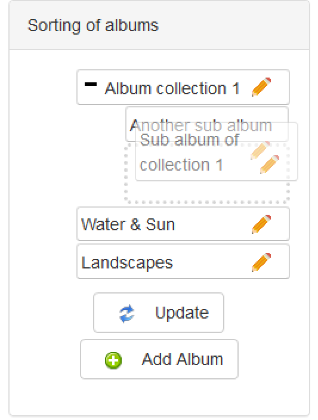

# Album management

## 1. Overview

On the album management page you get an overview about all albums and collections 

On the right side you will see the area for sorting albums/collections.

## 2. Differences between albums and collections

### Album

An album contains one or more images. You can set the permissions for each album in a different way.

### Collections

Collections are like a container or folder for one or more albums. Permissions set for a collection are not valid for the contained albums.  
A collection should not have images, as they will be nowhere displayed.  
you can recognize a collection on the displayed number of albums in it:  
 

## 3. Sorting albums

   
You can easily sort them by drag&drop.   
With a click on "+" you can expand a collection, with "-" reduce it.  
You can create a nested tree up to as many levels you want.

## 3. Additional buttons

Depending on your permissions \(see [Permissions](https://app.gitbook.com/@xoops/s/wggallery-tutorial/~/edit/drafts/-LspRs8jjiGYCcVslyVk/english/administration-menu/permissions)\) you will see addtional buttons like

* "Show album" \(see [Displaying albums](https://app.gitbook.com/@xoops/s/wggallery-tutorial/~/edit/drafts/-LspRs8jjiGYCcVslyVk/english/the-user-side/displaying-albums)\)
* "Show images index \(see[ Image index](https://app.gitbook.com/@xoops/s/wggallery-tutorial/~/edit/drafts/-LspRs8jjiGYCcVslyVk/english/the-user-side/image-index)\)
* "Image management \(see [Image management](https://app.gitbook.com/@xoops/s/wggallery-tutorial/~/edit/drafts/-LspRs8jjiGYCcVslyVk/english/the-user-side/image-management)\)
* "Upload images \(see [Uploading images](https://app.gitbook.com/@xoops/s/wggallery-tutorial/~/edit/drafts/-LspRs8jjiGYCcVslyVk/english/the-user-side/uploading-images)\)
* "Edit album" \(see [Create new album](https://app.gitbook.com/@xoops/s/wggallery-tutorial/~/edit/drafts/-LspRs8jjiGYCcVslyVk/english/the-user-side/create-new-album)\)
* "Edit album image" \(see [Album image](https://app.gitbook.com/@xoops/s/wggallery-tutorial/~/edit/drafts/-LspRs8jjiGYCcVslyVk/english/the-user-side/album-image)\)
* "Delete"
* "Download album"

