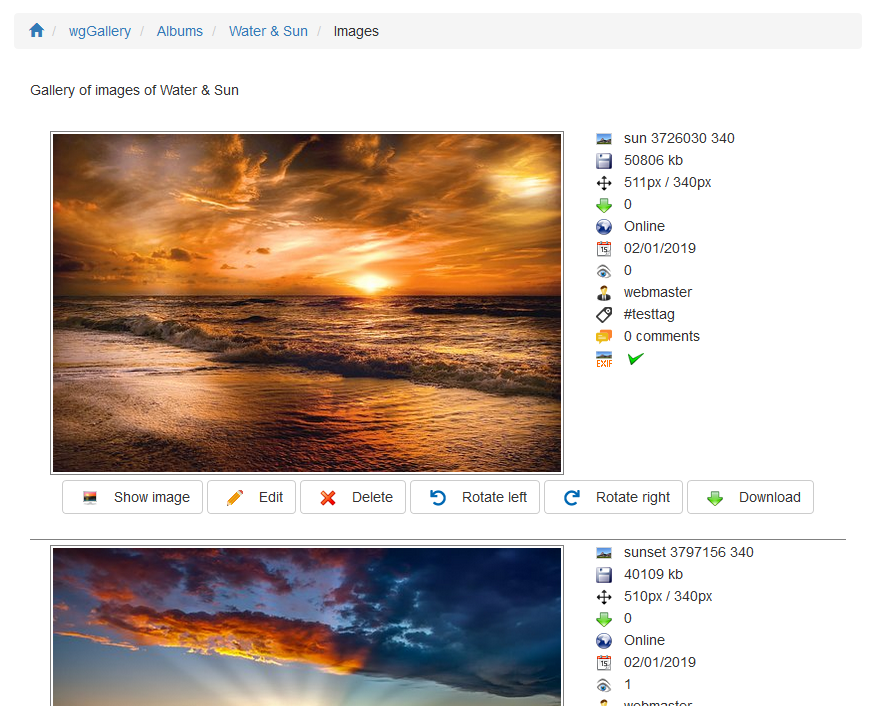

# Image index

On the image index you can see all files of a specific album.

On index site you can see

* a preview of the image
* information related to the image

For each image you can \(if you have the permission\)

* Show image: depending your setting in preferences [Options for display](../preferences/options-for-display.md) the image will be shown in a new tab, as modal, and so on.
* Edit image information
* Delete the image
* Rotate left or right
* Download: depending your settings in [Permissions](https://app.gitbook.com/@xoops/s/wggallery-tutorial/~/edit/drafts/-Lsp6ZJlrSkVXk5zy3up/english/administration-menu/permissions) the large or medium image will be provided for download

